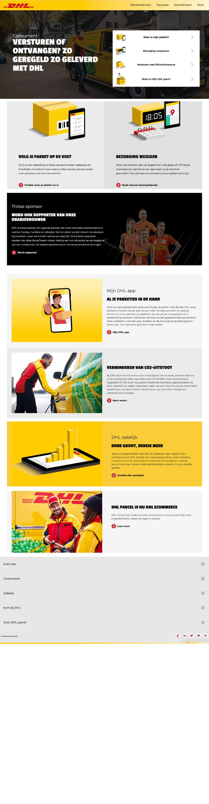

# Procesverslag Carmen Brands

  
uitwerken voor kick-off werkgroep

  ### Auteur:
  Carmen Brands

  #### Je startniveau:
  Blauw

  #### Je focus:
  Responsive

## Je website

  
uitwerken voor kick-off werkgroep

  ### Je opdracht:
  https://www.dhlecommerce.nl/nl

  #### Screenshot(s) van de eerste pagina (small screen): 
  Home pagina
  

  #### Screenshot(s) van de tweede pagina (small screen):
  Track en Trace pagina
  
 

## Toegankelijkheidstest 1/2 (week 1)

  
uitwerken na test in 2e werkgroep

  ### Toegankelijkheidstest
  
  
  
  
  
  

  ### Bevindingen
  1. ze maken geen gebruik van darkmode 
  2. met de screenreader worden knoppen als afbeelding geroepen.
  3. geen logische volgorde met de heading levels

## Breakdownschets (week 1)

  
uitwerken na afloop 3e werkgroep

  ### dynamisch deel (bijv menu): 
  

  ### wellicht nog een dynamisch deel (bijv filter): 
  

## Voortgang 1 (week 2)

  
uitwerken voor 1e voortgang

  ### Stand van zaken
  ik heb de eerste 2 html pagina's gemaakt zodat ik die goed kan neerzetten voordat ik met de css begin wel. dus ik wil met het gesprek nakijken of de html goed is neergezet zodat ik verder kan. En ik ben bezig geweest met de afbeeldingen te verzamelen

  ### Verslag van meeting
  hier na afloop snel de uitkomsten van de meeting vastleggen

  ik heb hier een gesprek met sybren gehad.
  hij had een aantal dingetjes over mijn html en dat waren de volgende;
  1. geen div's gebruiken je kan ze vervangen voor articles
  2. 1 h1 per pagina de rest oplopend doen
  3. geen n2e nav in de footer
  4. afbeeldingen invoegen

  na dit gesprek zaten er dus wat fouten in de html dus die moeten aangepast worden en dan kan ik beginnen aan de css

## Voortgang 2 (week 3)

  
uitwerken voor 2e voortgang

  ### Stand van zaken
  hier heb ik de html verbeterd en ben ik begonnen aan de css hier had ik wel wat moeite mee. Daarom heb ik wat meer tijd gestoken in het onderzoeken naar hoe ik de css kan neerzetten en hoe het allemaal werkt ik ben hier voornamlijk met w3school mee bezig geweest. en ik had besloten om een paar kopjes uit de html weg te laten omdat ik al genoeg moeite heb met de css en het responsive te krijgen dat ik daar al genoeg tijd aan kwijt ben

  

  ### Verslag van meeting
  hier na afloop snel de uitkomsten van de meeting vastleggen

  hier heb ik een gesprek gehad met sybren.
  ik heb hem mijn html laten nakijken op de verbeter punten daar had hij nog 1 puntje op en dat was een li toevoegen en dat heb ik gedaan. Daarnaast had ik een vraagje over mijn footer want ik wou weten hoe ik de extra opsommingstekens weg kreeg en daar heeft hij een code pen van gestuurd zodat ik daar naar kon kijken en toe passen ik kreeg het advies om we echt de focus te leggen op de css want daar liep ik wat in achter en dat ik optijd om hulp moet vragen wanneer het niet lukt met het hamburger menu.

## Toegankelijkheidstest 2/2 (week 4)

  
uitwerken na test in 9e werkgroep

  ### Toegankelijkheidstest
  
  
  
  
  

  ### Bevindingen
  1. Bekijk meer' word gezegd op knoppen, terwijl er iets anders staat.
  2. Afbeeldingen moeten duidelijker worden wat slaat op de tekst ernaast.
  3. de html had een paar warnings maar dat zijn punten die ze aangeven om te vervagen voor divs dus daar moet ik nog naar kijken
  4. de headings lopen nu wel logisch

## Voortgang 3 (week 4)

  ### Stand van zaken
  Deze periode was catastrofe ik had in de vakatie wat aan de css en html gedaan maar ik heb er ergens een fout in gekregen waardoor niks er meer uitzag zoals het moest en ik heb hier echt uren naar zitten zoeken wat het nou uiteindelijk kon zijn. en ik kon het gewoon niet vinden. maar daarvoor was ik er wel redelijk tevreden mee en was het hamburger menu werkend

  ### Verslag van meeting
  hier na afloop snel de uitkomsten van de meeting vastleggen

  Ik heb hier een gesprek met chris gehad.
  hij heeft geholpen met zoeken waar de fout en en uiteindelijk was het dus een fout in mijn html die ik was vergeten ik had een section toegevoegd maar die totaal niet meegenomen in de css. Daarnaast had ik met Chris doorgesproken dat ik mijn proces verslag moet bijwerken en de volledige focus moet leggen op het responsive maken. Daarnaast moet ik ook comfortabel worden met de code zodat ik het meer eigen maak en kan uitleggen waarom ik het heb gedaan.

## Eindgesprek (week 5)

  
uitwerken voor eindgesprek

  ### Je uitkomst - karakteristiek screenshots:
  Home pagina
  
  

  #### Screenshot(s) van de tweede pagina :
  Track en Trace pagina
  
  

  ### Dit ging goed/Heb ik geleerd: 
  Ik heb geleerd op de code meer eigen te maken doordat ik wat meer tijd heb geinvesteerd naar te kijken wat alles betekend en wat het doet daarnaast was ik erg blij met het hamburger menu dat die gelukt is met de hulp van een video

  

  ### Dit was lastig/Is niet gelukt:
  op de website van dhl zelf zit er in de footer een soort vouw menu die zodra hij kleiner wordt een dropdown menu krijgt ik heb gekeken hoe dit moest en ook gevraagd maar ik had er niet voldoende tijd voor om deze goed te krijgen dus heb ik heb gelaten zoals dat ik hem had 

  
  
  
  

## Bronnenlijst

  
continu bijhouden terwijl je werkt

  Nb. Wees specifiek ('css-tricks' als bron is bijv. niet specifiek genoeg). 
  Nb. ChatGpT en andere AI horen er ook bij.
  Nb. Vermeld de bronnen ook in je code.

  1. Video over hoe een hamburger menu werkt (had hier met de opdrachten nog moeite mee en moest dit 'live' even zien om het goed te begrijpen): https://www.youtube.com/watch?v=1iS0r238G4g
  2. Video over hoe ik een scroll in effect met javascript kon toepassen: https://www.youtube.com/watch?v=T33NN_pPeNI
  3. ik heb hulp gehad van Quinesha van Burgh zij heeft onderdelen uitgelegd zodat ik het beter begreep
  4. om de code meer te begrijpen met wat het betekend en wat het doet heb ik veel geexperimenteerd met https://www.w3schools.com

